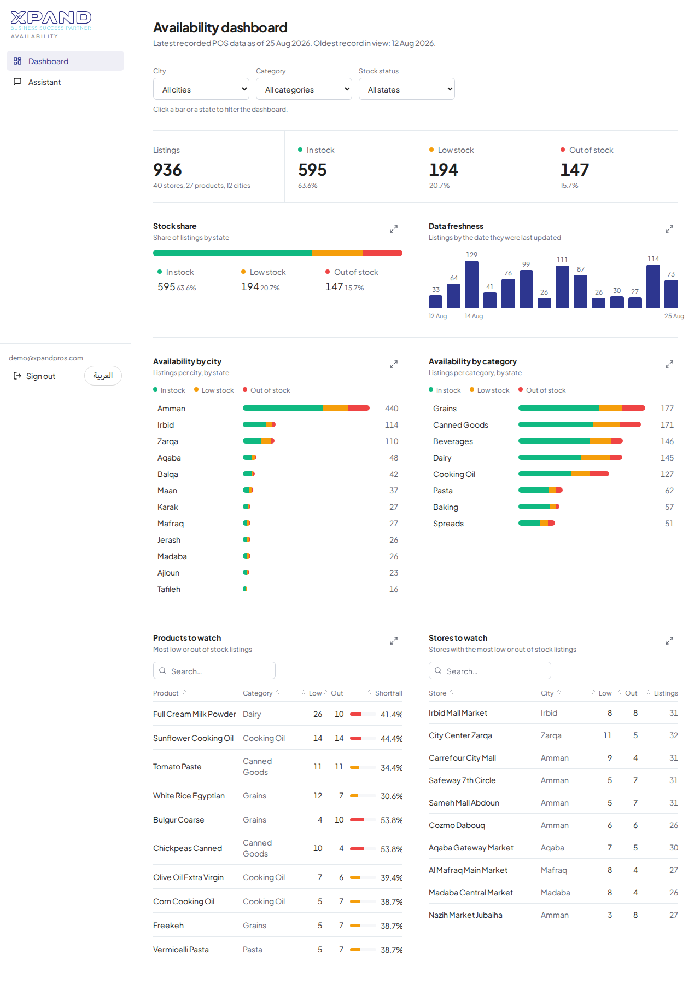

# AI & Automation Officer Assessment

Take-home assignment with two independent scenarios. **Live demo of Part 2: https://xpand.medgan.ai**

| Part | Scenario | What is here |
|---|---|---|
| 1 | [**From Inbox to Board**](part-1-email-to-clickup) | A working POC (**Inbox Automation**) that turns work-request emails into ClickUp tasks with an AI agent, with human review for exceptions: Strands agent on Bedrock AgentCore, read-only MCP gateway, DynamoDB idempotency, approve/edit/reject. ClickUp is verified live; the Outlook (Microsoft Graph) mailbox is **not yet connected**, so the deployed demo reads a clearly labelled sample mailbox |
| 2 | [**Answering from the Data**](part-2-data-to-answers) | A working, deployed app that lets marketing answer "where can I buy this?" in seconds: an authenticated bilingual (English/Arabic) dashboard and a streaming assistant over the POS data |

## At a glance

**Part 1.** An Inbox Reviewer Agent (Strands on Amazon Bedrock AgentCore) picks one of five actions per email: create a task, update a task, reply, ignore, or send to a person. The agent can only *read* ClickUp (through an AgentCore Gateway); a deterministic backend validates its proposal, maps names and dates to real ClickUp values, applies policy, and executes clear low-risk cases. Ambiguity, missing information, possible duplicates and sensitive or external replies go to a person who approves, edits or rejects, enforced by the backend. Duplicates are prevented by message-level idempotency (conditional DynamoDB writes) and a marker in each created task. See its README for what is verified and what is blocked.

**Part 2.** API Gateway (Cognito-protected) → Bedrock AgentCore Runtime → Strands agent → `query_availability` (deterministic) → POS data in S3, with the web app on AWS Amplify. The model interprets and writes; the tool retrieves; a deterministic check makes sure every store, price and quantity in an answer comes from the returned records. Answers stream, work in English, Modern Standard Arabic and Jordanian dialect, and show the matching records as a table or chart.



## How Part 1 and Part 2 coexist

They share one deployment, not one purpose. One sign-in (Amazon Cognito), one Amplify site (https://xpand.medgan.ai) with a shared shell and navigation, one API Gateway and one AWS CDK stack (`part-2-data-to-answers/infrastructure`). The sidebar has two groups: **Availability** (Part 2: Dashboard, Assistant) and **Inbox Automation** (Part 1: Inbox, Review queue, Activity). Part 1's backend code lives in `part-1-email-to-clickup/src`; its resources are added to the stack by one construct and are removed with the stack. The two parts have separate runtimes, data, tests and IAM roles; Part 2's behaviour is unchanged (its test suites still pass).

## Repository map

```
├── part-1-email-to-clickup/    Inbox Automation: src/ (agent, policy, adapters, API), tests/, infrastructure/ (CDK construct), architecture/, README
├── part-2-data-to-answers/     implementation: src/ (agent, tools, web app), tests/, infrastructure/ (AWS CDK), architecture/
└── docs/
    ├── final-submission/       the two submission documents (PDF)
    ├── architecture/           workflow and architecture figures for both parts
    ├── screenshots/            the Part 2 app in English and Arabic
    └── part-2-implementation-and-testing.md
```

## Run the project

See [part-2-data-to-answers/README.md](part-2-data-to-answers/README.md) for setup, configuration, the API, deployment and tests of Part 2, and [part-1-email-to-clickup/README.md](part-1-email-to-clickup/README.md) for Part 1 (policy, setup of ClickUp and Microsoft Graph, tests, blockers). In short: `make install && make test` runs the unit tests with no AWS access; `make deploy` builds and deploys everything with the CDK.

The live site needs a sign-in. Sign-up is disabled; the demo user is created by `infrastructure/scripts/create_demo_user.sh` and its credentials are shared with the reviewers directly rather than stored in the repository.

## License

MIT, see [LICENSE](LICENSE).
