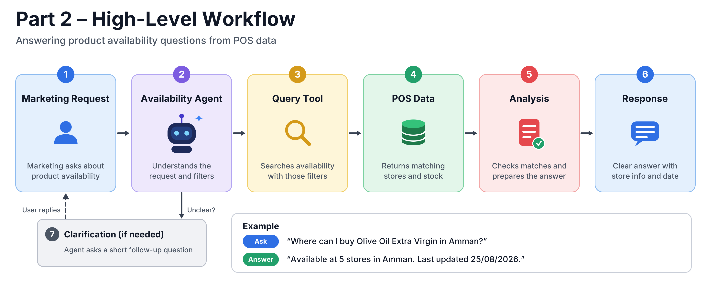
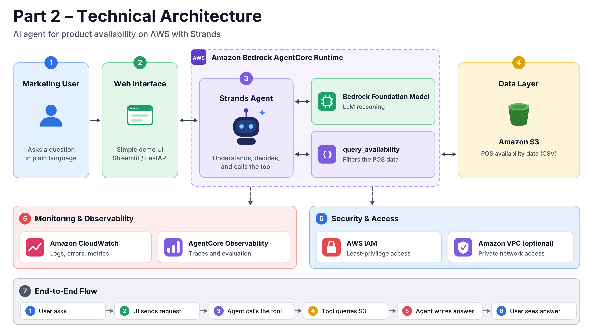

# Diagrams

## Part 1: From Inbox to Board

| Figure | File |
|---|---|
| 1. High-level business workflow | [part-1-figure-1-business-workflow.png](part-1-figure-1-business-workflow.png) |
| 2. Technical workflow (agent + MCP) | [part-1-figure-2-technical-workflow.png](part-1-figure-2-technical-workflow.png) |
| 3. AWS architecture | [PNG](../../part-1-email-to-clickup/architecture/part-1-aws-architecture.drawio.png) · [SVG](../../part-1-email-to-clickup/architecture/part-1-aws-architecture.drawio.svg) · [PDF](../../part-1-email-to-clickup/architecture/part-1-aws-architecture.drawio.pdf) · [draw.io](../../part-1-email-to-clickup/architecture/part-1-aws-architecture.drawio) · [guide](../../part-1-email-to-clickup/architecture/part-1-aws-architecture.md) |

## Part 2: Answering from the Data

| Figure | File |
|---|---|
| 1. High-level workflow | [part-2-figure-1-high-level-workflow.png](part-2-figure-1-high-level-workflow.png) |
| 2. Technical architecture | [part-2-figure-2-technical-architecture.png](part-2-figure-2-technical-architecture.png) |
| 3. AWS architecture (as built, with Amplify and Cognito) | [PNG](../../part-2-data-to-answers/architecture/part-2-aws-architecture.drawio.png) · [SVG](../../part-2-data-to-answers/architecture/part-2-aws-architecture.drawio.svg) · [PDF](../../part-2-data-to-answers/architecture/part-2-aws-architecture.drawio.pdf) · [draw.io](../../part-2-data-to-answers/architecture/part-2-aws-architecture.drawio) · [guide](../../part-2-data-to-answers/architecture/part-2-aws-architecture.md) |

The Part 2 AWS diagram is the as-built version: it adds the web app (Amplify) and sign-in (Cognito) that the original submission document describes as an optional interface.
