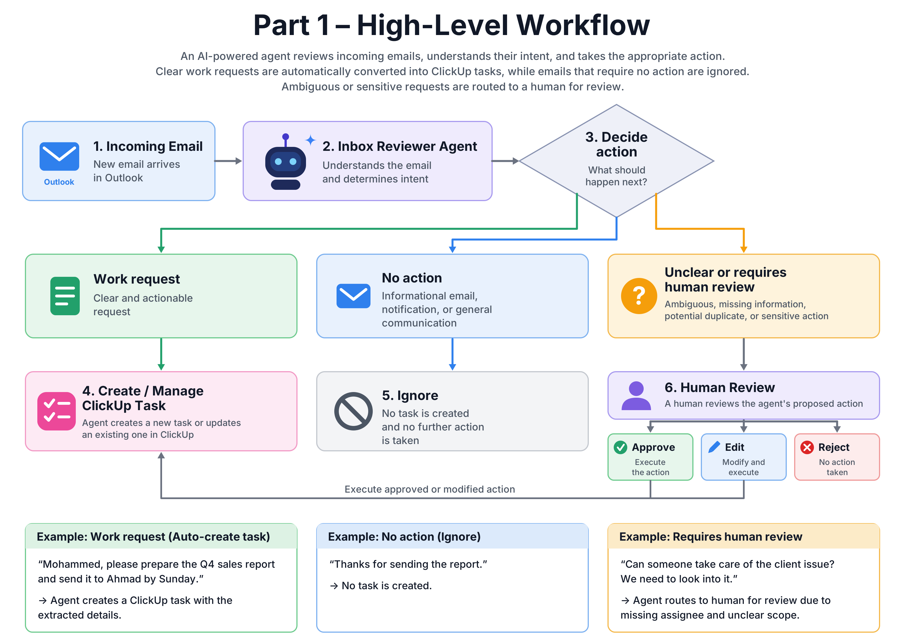
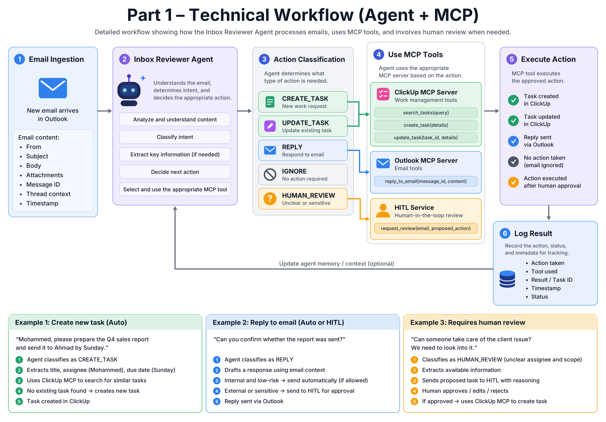

# Part 1: From Inbox to Board

**Design for turning Outlook work-request emails into ClickUp tasks with an AI agent.** The brief asks for a design, so this part is documentation and diagrams only; there is no code to run. The working implementation in this repository is Part 2.

## The problem

Work requests arrive by email and are tracked in ClickUp. Someone reads every email, decides whether it is a real request, and creates the task by hand. It takes part of every morning, and requests still get missed, logged twice, or given the wrong urgency.

## The answer in one paragraph

An **Inbox Reviewer Agent** (Strands Agents on Amazon Bedrock AgentCore Runtime, Nova 2 Lite) reads each new email and chooses one of five actions instead of just asking "is this a task?". Routine, clear cases run automatically through MCP tools (ClickUp and Outlook behind AgentCore Gateway). Anything ambiguous, incomplete, possibly duplicated or sensitive goes to a person first, who can approve, edit or reject.

| Action | When | Result |
|---|---|---|
| `CREATE_TASK` | Clear, actionable request with enough information | New ClickUp task |
| `UPDATE_TASK` | Refers to work that already exists | Existing task found and updated |
| `REPLY` | The right response is communication, not a task | Reply drafted or sent through Outlook, under policy |
| `IGNORE` | Informational or conversational ("Thanks for the report") | Nothing happens |
| `HUMAN_REVIEW` | Ambiguity, missing critical data, possible duplicate, sensitive action | A reviewer approves, edits or rejects the proposed action |

**Should every email become a task automatically? No.** Automation is the default for clear, low-risk requests; people handle the exceptions. The agent must not create work just because an email contains an instruction-like phrase.

## Workflow

The agent only reasons and selects actions; integrations sit behind MCP, so ClickUp and Outlook can change without touching the reasoning. Tool access is limited to `search_tasks`, `create_task`, `update_task` (ClickUp) and `reply_to_email` (Outlook).

## AWS architecture

Higher quality: [SVG](architecture/part-1-aws-architecture.drawio.svg) · [PDF](architecture/part-1-aws-architecture.drawio.pdf) · editable [draw.io source](architecture/part-1-aws-architecture.drawio). Service-by-service guide: [architecture/part-1-aws-architecture.md](architecture/part-1-aws-architecture.md).

Outlook (Microsoft Graph webhook) → API Gateway → Lambda (validate, fetch the full email, idempotency check in DynamoDB) → Strands agent on AgentCore Runtime → Nova 2 Lite → AgentCore Gateway (ClickUp MCP, Outlook MCP). Exceptions pause in Strands' native human-in-the-loop; an optional Cognito + Amplify portal lets reviewers decide. AgentCore Observability and CloudWatch trace everything.

## Duplicates and state

Each email is recorded by message ID before processing, so a repeated delivery cannot create a second task. DynamoDB holds only that lightweight state; ClickUp remains the system of record.

## Example scenarios

| Email | Outcome |
|---|---|
| "Please prepare the Q4 sales report and send it to Ahmad by Sunday." | `CREATE_TASK`: extract title, assignee and due date, search for a similar task, create only if none exists |
| "Thanks for sending the report." | `IGNORE` |
| "Can someone take care of the client issue? We need to look into it." | `HUMAN_REVIEW`: assignee and scope are unclear |
| "Please move the due date of the Q4 report to Monday." | `UPDATE_TASK`: find the task, update it |
| The same email delivered twice | Idempotency check finds the message ID; no duplicate |

## Another approach considered and rejected

**Deterministic, rule-based automation** (keywords, templates, fixed conditions). Email wording, completeness and context vary too much: the rule set would grow without end and still fail on ambiguous requests, duplicate detection and consistent field extraction. The agentic design keeps the reasoning flexible while constraining execution through explicit actions, MCP tool boundaries and human review.

## Security, reliability, observability

Least-privilege IAM; Cognito for the reviewer portal; KMS and WAF where needed. Reliability comes from message-ID idempotency, structured (machine-checkable) agent outputs, human review when information is insufficient, and tool boundaries. AgentCore Observability and CloudWatch cover agent, model and tool calls, errors and latency; result metadata (action, status, task ID, timestamps) is stored for traceability.

## Documents

The full submission document is in [`../docs/final-submission`](../docs/final-submission).
