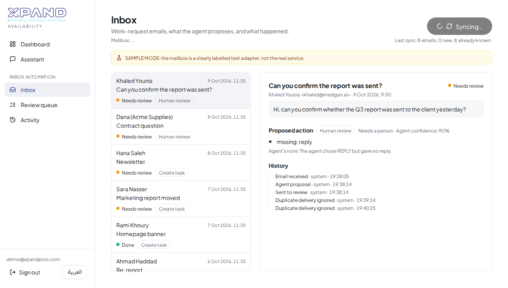
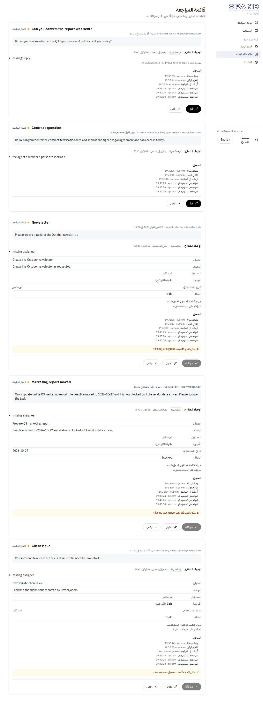
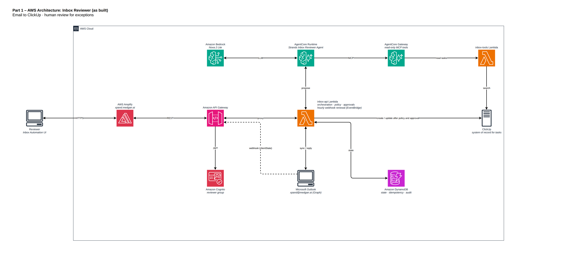

# Part 1: From Inbox to Board (Inbox Reviewer Agent)

Work-request emails arrive in the `xpand@medgan.ai` mailbox. An **Inbox Reviewer Agent** reads each one and proposes one of five actions; a deterministic backend validates the proposal, runs the routine ones automatically in ClickUp, and sends everything doubtful to a person who can **approve, edit or reject**.

It is built as a working POC inside the same application and AWS stack as Part 2, reachable from the same sign-in at **https://xpand.medgan.ai** (sidebar group **Inbox Automation**: Inbox, Review queue, Activity; English and Arabic).

| Inbox: email, proposal, real field values | Review queue (Arabic, right-to-left) |
|---|---|
|  |  |

More: [reviewer decision dialog (Arabic)](../docs/screenshots/ar-inbox-03-edit-dialog.png), [activity trail with real ClickUp task ids](../docs/screenshots/en-inbox-04-activity.png), [phone layout](../docs/screenshots/en-inbox-05-mobile.png). These are screenshots of this application. ClickUp's own web UI could not be captured (it needs an interactive sign-in); each created task is linked from the app and its id appears in the audit trail.

## What is verified and what is not

| Piece | Status | Evidence |
|---|---|---|
| ClickUp REST (search, get, create, update) on the **real workspace** | Verified | 8 live tests and 4 deployed tests create, read, update, search and delete real tasks in the dedicated list |
| Strands agent on Amazon Bedrock (Nova 2 Lite) | Verified | live tests with real Bedrock; the deployed AgentCore runtime answered correctly over IAM auth |
| AgentCore Gateway (MCP) with Lambda target | Verified | listed the tools as an MCP client and called `clickup_search_tasks` against the real ClickUp list from AWS |
| DynamoDB idempotency and conditional writes | Verified | moto contract tests plus a concurrency test against the **real** table |
| Cognito reviewer-group authorization | Verified | deployed tests with a real non-reviewer Cognito user |
| Inbox, Review queue and Activity UI (en/ar, phone) | Verified | 175 web unit tests, 8 Playwright tests on production |
| **Microsoft Graph / Outlook** | **Verified for reading** | Device-code sign-in as `xpand@medgan.ai` done; the deployed app runs with `inbox_outlook_mode=graph`. Real **Sync inbox** runs: ClickUp notifications were classified `IGNORE`; a real "create a task" email was reviewed, edited and approved into a real ClickUp task; a real "please confirm" email produced a `REPLY` proposal that, once approved, was **sent from `xpand@medgan.ai` and received** in the sender's inbox |
| Graph change notifications (webhook) and subscription renewal | **Verified** | A real email appeared in the inbox about 10 seconds after it arrived, with no click: Graph called `POST /inbox/webhook`, the sync ran as `graph-webhook`, the agent classified it. Renewal runs hourly; **Sync inbox** still works |
| Sending a real Outlook reply | **Verified** | One approved reply sent through Graph and received; replies are never sent without a reviewer's approval |

### Live updates (Graph change notifications)

Graph calls the public route `POST /inbox/webhook` when mail arrives. The route is authenticated by a secret `clientState` that only this deployment and Graph know (constant-time comparison; anything else gets 401 and starts nothing). A genuine call only starts the normal sync: the notification content is never used, so the webhook adds no decision logic. Calls that arrive while a sync is running ask it to go round once more. An hourly EventBridge rule renews the subscription (mail subscriptions last about 70 hours) and runs a catch-up sync, so a missed notification delays mail by at most an hour. The Inbox page shows a green **Live updates on** indicator and refreshes every 15 seconds while the subscription is active. In sample mode there is no webhook.

### Mailbox connection

The Entra app registration (single tenant, public client, delegated permissions, admin-consented, assignment required for `xpand@medgan.ai` only) is in place and `xpand@medgan.ai` is signed in via `connect_outlook.sh`. Deploy with `INBOX_OUTLOOK_MODE=graph make deploy` (the default stays `sample`). 

## The five actions

| Action | When | What happens |
|---|---|---|
| `CREATE_TASK` | Clear, actionable request, not already tracked | New ClickUp task (automatic only if the policy conditions below hold) |
| `UPDATE_TASK` | The email is about work that already exists | The existing task is found and updated |
| `REPLY` | A written answer is the right response | A reply draft is created; **sending needs approval** |
| `IGNORE` | Informational or conversational | Nothing happens |
| `HUMAN_REVIEW` | The agent cannot decide safely | Goes to the Review queue; the reviewer chooses create / reply / dismiss |

**Should every email become a task automatically? No.** Clear, low-risk requests run automatically; ambiguity, missing information, uncertain duplicates and sensitive or external communication go to a person.

## Architecture



[SVG](architecture/part-1-aws-architecture.drawio.svg) · [PDF](architecture/part-1-aws-architecture.drawio.pdf) · [draw.io](architecture/part-1-aws-architecture.drawio) · [guide](architecture/part-1-aws-architecture.md). Original design figures: [business workflow](../docs/architecture/part-1-figure-1-business-workflow.png), [technical workflow](../docs/architecture/part-1-figure-2-technical-workflow.png).

```
Sync inbox (Graph or sample mailbox)
  -> idempotent claim in DynamoDB (conditional write)
  -> AgentCore Runtime (Strands agent, Nova 2 Lite) reads ClickUp through the Gateway and PROPOSES a validated Triage
  -> backend maps names/dates/statuses to REAL ClickUp values, finds similar tasks, applies policy
  -> automatic: execute in ClickUp   |   otherwise: Review queue (approve / edit / reject)
  -> every step is written to the audit trail
```

| Responsibility | Component |
|---|---|
| Email ingestion and mailbox operations | Microsoft Graph adapter (`src/inbox/adapters/graph.py`) |
| Intent understanding, action selection, field extraction | Strands agent on AgentCore Runtime (`src/inbox/agent.py`) |
| Authorized external reads for the agent | AgentCore Gateway: two **read-only** ClickUp tools |
| Schema validation, policy, approvals, idempotency, state transitions, execution | Backend (`src/inbox/service.py`, `policy.py`, `resolve.py`, `store.py`, `api.py`) |
| System of record for tasks | ClickUp |

**A deliberate change from the design document:** the design had the agent execute create/update/reply through MCP. As built, the **model can only read** (search/get ClickUp tasks); creating tasks and sending mail happen only in the backend, after policy and approval. That way no prompt injected into an email can reach an external write.

### What was added to the AWS stack

Reused from Part 2: Amplify site, Cognito pool and authorizer, API Gateway, CDK stack, S3 asset bucket, IAM patterns. New (all created by `infrastructure/inbox_automation.py`, prefix `xpand-inbox`):

| Resource | Purpose |
|---|---|
| DynamoDB table `xpand-inbox-state` (on demand, point-in-time recovery) | Message state, leases, proposals, audit |
| Lambda `xpand-inbox-api` | Sync worker, orchestration, policy, approvals, execution (behind API Gateway + Cognito) |
| Lambda `xpand-inbox-tools` | The two read-only ClickUp tools (Gateway target); no mailbox access |
| AgentCore Gateway `xpand-inbox-tools` (IAM inbound) | MCP boundary for the agent |
| AgentCore Runtime `inbox_reviewer_agent` (IAM inbound) | Runs the Strands agent. A second runtime because Part 2's runtime is JWT-only and a Lambda cannot call it with SigV4 |
| Cognito group `inbox-reviewers` | Who may sync, read, approve, edit and reject |
| Secrets Manager `xpand/inbox/clickup`, `xpand/inbox/graph` | Created by the setup scripts, never by CDK, so no secret is in a template |

## Policy: what runs automatically and what needs a person

All rules are deterministic code in `policy.py` with explicit defaults in `config.py`. No model decides any of this.

| Rule | Behaviour |
|---|---|
| `IGNORE` | Automatic |
| `CREATE_TASK` | Automatic only if title, description and an **assignee that resolves to a real ClickUp member** are present, confidence is at least 0.7, there is no sensitive content and no similar existing task |
| Similar task exists | Score at least 0.8: "likely duplicate", review. Between 0.5 and 0.8: "possible duplicate", review |
| `UPDATE_TASK` | Automatic only if the target task was found by search with score at least 0.8 and only status, due date, priority or description change. Changing the assignee always needs review |
| `REPLY` | **Every reply needs approval** (`INBOX_AUTO_SEND_REPLIES=false`). If switched on, it still never auto-sends to an external or sensitive recipient. The check uses the real recipient (the sender), not the model's claim |
| Sensitive content | Keywords (legal, contract termination, salary, payroll, confidential, bank details, ...) or the agent's own flag force review |
| Missing information | Never invented. Assignee, due date and status are `not stated` unless the email says so. The only default filled in is **priority "normal"**, shown as "(default)", set in configuration |
| New task status | ClickUp gives a new task the list's *first* status (`blocked` here), so a created task gets the explicit configured status `to do` |
| Invalid agent output | Becomes a review item, never an action. An action without its payload (for example `REPLY` with no text) degrades to `HUMAN_REVIEW` |

**Approve, Edit and Reject are enforced by the backend.** The approval gate is a conditional DynamoDB write (`PENDING_REVIEW` to `EXECUTING`), so a double click or two reviewers can never execute twice; the reviewer identity and group come from the verified Cognito token, never the request body; edits are re-validated and re-resolved against real ClickUp members and statuses; a client-supplied "approved" flag does nothing; Reject performs no external call.

## Reliability and security

- **Message-level idempotency:** conditional put on the message ID, explicit state machine, lease-based processing with takeover of an abandoned worker.
- **Task-level duplicate detection:** ClickUp is searched before every create. A hidden `[email:<id>]` marker in the task description lets a retry after a lost answer *adopt* the task that was created instead of creating a second one.
- **Retries only where safe:** reads and the agent proposal are retried (bounded); task creation and sending are never retried automatically. Failures are stored as `FAILED` with a retryable flag and can be retried from the UI.
- **Least privilege:** each Lambda and the runtime have only the permissions they need; the tools Lambda cannot read the mailbox or write to ClickUp.
- **Access control:** every `/inbox` route requires the Cognito reviewer group, including reads (they expose email text).
- **Secrets:** ClickUp token and Graph refresh token live only in Secrets Manager; they are never in Git, logs, error messages or the browser.
- **Minimal data and redacted logs:** at most 1,500 characters of an email body are stored; the audit trail never holds email text; log lines mask addresses and numbers.
- **Prompt injection:** email text is data inside delimiters, the agent has no write tools, and its output is only a suggestion.
- **Known limit:** the `From` header can be spoofed; "internal sender" is not authentication. Replies therefore need approval by default.

## Setup

### ClickUp

1. In ClickUp: avatar, **Settings**, **Apps**, **API Token**, generate a personal token (starts with `pk_`).
2. Create a dedicated List (statuses `to do`, `in progress`, `blocked`, `done`). Its URL is `https://app.clickup.com/<TEAM_ID>/v/li/<LIST_ID>`.
3. Store them without ever typing the token into a terminal history or chat: `infrastructure/scripts/configure_clickup.sh` (hidden prompt, goes to Secrets Manager `xpand/inbox/clickup`).
4. Check: `cd src && PYTHONPATH=. python -m inbox.cli check-clickup`.

The assignee must be a real member of the workspace. A token pasted anywhere visible should be regenerated.

### Microsoft Graph setup

OAuth 2.0 **delegated** flow for the one mailbox, with a **public client** (no client secret exists) and the **device-code** sign-in, so the refresh token is the only credential and it is stored only in Secrets Manager.

1. Microsoft Entra admin center, **App registrations**, **New registration**: name `XPAND Inbox Reviewer`, *single tenant*, no redirect URI.
2. Copy the **Application (client) ID** and **Directory (tenant) ID** (not secrets).
3. **Authentication**, Advanced settings, **Allow public client flows = Yes**.
4. **API permissions**, Microsoft Graph, **Delegated**: `Mail.ReadWrite`, `Mail.Send`, `offline_access`, `User.Read`; **Grant admin consent**. These are the minimum for reading mail, creating reply drafts and sending an approved reply, scoped by delegation to the one mailbox. (`Mail.Send` can be dropped if replies are never sent from here.)
5. Make sure `xpand@medgan.ai` is a licensed Exchange mailbox, then run `part-2-data-to-answers/infrastructure/scripts/connect_outlook.sh --tenant-id <GUID> --client-id <GUID>` and sign in **as the mailbox** in a private window. It refuses to store anything if a different account signed in.
6. Redeploy with the real mailbox: from `part-2-data-to-answers/infrastructure`, `cdk deploy -c inbox_outlook_mode=graph` (or add `"inbox_outlook_mode": "graph"` to the `context` in `cdk.json` so `make deploy` keeps it).

### Environment variables

`.env.example` lists every setting with its default and no secrets. The deployed Lambdas receive them from CDK.

### Deploy

From `part-2-data-to-answers`: `make deploy` (packages the agent and the Lambda, runs `cdk deploy`, creates the demo user and adds it to `inbox-reviewers` via `create_demo_user.sh`, builds and publishes the web app). To add an existing user: `aws cognito-idp admin-add-user-to-group --user-pool-id <pool> --username <email> --group-name inbox-reviewers`. The new routes are `/inbox/*` on the existing API.

## API

All routes need `Authorization: Bearer <Cognito ID token>` and membership of `inbox-reviewers`.

| Route | Purpose |
|---|---|
| `GET /inbox/config` | Mailbox, modes, policy, real ClickUp members and statuses, list link |
| `GET /inbox/messages` / `GET /inbox/messages/{id}` | List with sync state; one message with proposal, result, history and `can_approve` |
| `POST /inbox/sync` | Starts a sync (answers 202; a worker invocation processes the mailbox) |
| `GET /inbox/review` | Items waiting for a person |
| `POST /inbox/review/{id}/approve` | Approve and execute (422 with the reasons if it cannot run yet) |
| `POST /inbox/review/{id}/edit` | Edit then approve; for an undecided item `{"action": "CREATE_TASK" or "REPLY" or "IGNORE", ...}` |
| `POST /inbox/review/{id}/reject` | Reject; nothing external happens |
| `POST /inbox/messages/{id}/retry` | Retry a retryable failure |
| `GET /inbox/activity` | The audit trail |

## MCP tool contracts (AgentCore Gateway target `inbox-tools`)

Defined once in `src/inbox/tools.py` (`TOOL_SCHEMAS`) and used by both the Lambda and the CDK. The model can use only these; the gateway also lists its built-in tool-discovery search (`x_amz_bedrock_agentcore_search`), which only searches tool definitions.

| Tool | Input | Output |
|---|---|---|
| `clickup_search_tasks` | `query` (string, required), `limit` (1 to 10) | `{"tasks": [{id, name, status, assignees, url, priority, due_date, description (first 240 chars), match}]}` best match first |
| `clickup_get_task` | `task_id` (string, required) | one task in the same shape |

Errors are returned as `{"error": "<code>", "retryable": bool}` so the model can react. There is no create, update, send, draft or mailbox tool.

## Tests

Run from this folder with `make test`, `make test-live`, `make test-e2e` (they use the Part 2 virtualenv).

| Layer | Count | Real or mocked |
|---|---|---|
| Unit (`tests/unit`) | see `make test` (webhook, reply and path-decoding tests included) | **Mocked**: in-memory ClickUp and mailbox, scripted agent, fake HTTP for ClickUp/Graph/AgentCore, moto for DynamoDB |
| Live (`tests/live`) | 8 | **Real** Amazon Bedrock agent and **real ClickUp list**; Outlook is the sample mailbox. Every task created is deleted afterwards |
| Deployed e2e (`tests/e2e`) | 5 + 1 skipped | **Real** Cognito users, deployed API, AgentCore runtime and gateway, DynamoDB, ClickUp, the **real mailbox** and the webhook (handshake, forged calls refused). The 8-email scenario needs the sample mailbox and skips itself when the stack reads the real one |
| Web unit (Part 2 app) | 175 | Mocked API |
| Browser (Playwright, production) | Sample scenarios: `E2E_INBOX_MODE=sample`. Real mailbox, read-only check: `E2E_INBOX_MODE=graph` (2 passed, English and Arabic) | Real deployed app in English and Arabic; the scenarios that approve and reject never run against real mail |

The 11 scenarios of the brief are covered mocked and with real integrations:

| # | Scenario | Mocked (unit) | Real (live and deployed) |
|---|---|---|---|
| 1 | Clear request creates a task with correct fields | yes | yes: real task with assignee, priority, due date, status and marker |
| 2 | Informational email is ignored, nothing created | yes | yes |
| 3 | Ambiguous request goes to review | yes | yes |
| 4 | Existing work finds and updates the matching task | yes | yes: a seeded real task is updated |
| 5 | Repeated delivery creates no duplicate | yes (sequential and concurrent) | yes: second sync, 0 new, no extra task; real DynamoDB atomicity |
| 6 | Different emails about existing work are flagged | yes | yes |
| 7 | Sensitive external reply needs approval before sending | yes | yes (sample mailbox: nothing sent without the reviewer) |
| 8 | Missing fields are not invented | yes | yes |
| 9 | ClickUp or Outlook failure is safe and recoverable | yes (timeout, lost answer, agent unavailable, mailbox error, non-retryable) | partly: a real agent-runtime error was recorded as a retryable `FAILED` item and surfaced in the UI (this exposed a bug that was then fixed); ClickUp and Graph outages are covered by mocks only |
| 10 | Unauthorized user or action is rejected | yes | yes: real non-reviewer Cognito user denied on every route |
| 11 | Rejection executes nothing | yes | yes |

Model output varies. The suites assert safety invariants always and action choices only where the email is unambiguous.

## Limitations and next steps

1. A real reply **draft** (as opposed to a send) has not been exercised; replies are created and sent only after approval.
2. ClickUp search reads the list (up to 500 tasks) and matches titles locally; a much larger list needs ClickUp's search or a webhook-fed index.
3. Duplicate matching is title similarity; semantic matching (embeddings) is a possible upgrade.
4. The agent can be slow on a cold start (about 10 s per email); a few emails are processed in parallel.
5. `From` spoofing is not defended beyond requiring approval for replies.

## Cost and cleanup

Everything is usage-based and sized for an assessment (the hourly renewal is one tiny Lambda call and one Graph request an hour): a handful of emails costs a negligible amount in Bedrock tokens, Lambda, DynamoDB (on demand) and AgentCore. The only fixed charge is Secrets Manager (a small monthly fee per secret). CloudWatch logs are kept 30 days.

Cleanup: `make destroy` (Part 2 folder) removes the stack, including the table, Lambdas, gateway, runtime and group. The two secrets are outside CDK: `aws secretsmanager delete-secret --secret-id xpand/inbox/clickup --force-delete-without-recovery` (and `.../graph`). Also revoke the Entra app registration and regenerate the ClickUp token.

## Documents

Design: [`../docs/final-submission`](../docs/final-submission). Implementation and testing notes: [`../docs/part-1-implementation-and-testing.md`](../docs/part-1-implementation-and-testing.md).
