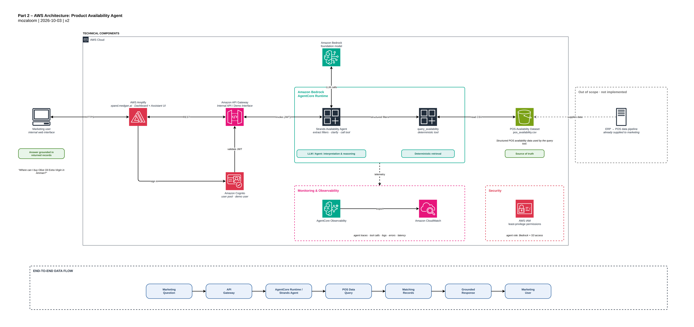

# Part 2: Data to Answers (Product Availability Agent)

Marketing keeps getting the same questions: *where can I buy this product, which shop carries it, is it in stock?* This part turns the supplied POS availability CSV into an internal web app with two things:

- an **Availability dashboard** (stock status by city, category, store and product, plus data freshness), and
- an **Availability Assistant** that answers natural-language questions **only from the matching POS records**, which it shows next to the answer.

The ERP-to-marketing data pipeline is out of scope; the app starts from the supplied `data/pos_availability.csv`.

**Live demo:** https://xpand.medgan.ai (sign-in required; see [Demo user](#demo-user)).



> Higher quality: [SVG](architecture/part-2-aws-architecture.drawio.svg) / [PDF](architecture/part-2-aws-architecture.drawio.pdf). Details in [architecture/part-2-aws-architecture.md](architecture/part-2-aws-architecture.md).

## How it works

```
Browser ──> AWS Amplify (xpand.medgan.ai)           static Next.js app, signs in with Amazon Cognito (SRP)
   │
   └─ ID token ─> Amazon API Gateway                Cognito authorizer, request validation, throttling, CORS
                     │  HTTPS + same token
                     └─> Bedrock AgentCore Runtime  validates the JWT again, runs the Python app
                            ├─ GET  /dashboard  -> deterministic analytics (no model)
                            └─ POST /ask        -> Strands agent ─> Amazon Bedrock (Nova 2 Lite)
                                                      └─ query_availability (deterministic) ─> S3: pos_availability.csv
```

The design rule that keeps answers trustworthy:

| Layer | Responsibility |
|---|---|
| Agent + LLM | Interpret the question, extract filters, ask for clarification, write the answer |
| `query_availability` | Deterministic retrieval: same filters, same records, with explicit `ambiguous` / `no_match` signals |
| S3 POS data | Source of truth |
| Grounding check | Every store, price and quantity in the answer must exist in the returned records (one corrective retry, then a records-only fallback) |

### Agent behaviour

- Never invents stores, products, prices, quantities or availability.
- Extracts the most specific filters it can: product, pack size, city, area, store, availability.
- Asks a clarification question **only** when the tool reports an ambiguous product (for example "tea" matches three products) or the message gives nothing to search for. It does not ask when it can search.
- Treats *In Stock*, *Low Stock* and *Out of Stock* as different states.
- Reports "no matching records" plainly, with real suggestions, and **never silently widens a search**; it asks first.
- Says the data is the latest recorded POS data ("as of 25 Aug 2026"), not a live inventory feed.
- Never reveals internal fields (sales representatives, SKUs, store ids) and ignores instructions hidden in a question.

## Repository layout

```
part-2-data-to-answers/
├── data/pos_availability.csv          supplied POS data (936 rows, 40 stores, 27 products, 12 cities)
├── src/
│   ├── config.py                      settings from environment variables
│   ├── tools/                         availability.py (search), analytics.py (dashboard), grounding.py, strands_tool.py
│   ├── agent/                         prompts.py, agent.py, service.py, runtime.py (AgentCore entrypoint), cli.py
│   └── app/                           Next.js web app (login, dashboard, assistant)
├── tests/                             unit/  live/  e2e/  sample_queries.json
├── infrastructure/                    CDK stack + deploy scripts
├── architecture/                      diagram (drawio, png, svg, pdf) and guide
└── Makefile
```

## Quick start (local)

Prerequisites: Python 3.12, [uv](https://docs.astral.sh/uv/), Node 22, and AWS credentials with Amazon Bedrock access (Nova 2 Lite) for anything that calls the model.

```bash
make install                     # Python venv + dependencies
make test                        # backend unit tests (no AWS needed)

export AWS_PROFILE=pocs AWS_REGION=us-east-1
PYTHONPATH=src .venv/bin/python -m agent.cli "Where can I buy Olive Oil Extra Virgin in Amman?"
```

Run the web app locally against the deployed API (no CORS setup needed; `next dev` proxies `/api`):

```bash
cd src/app
cp .env.example .env.local       # fill in the Cognito ids and DEV_API_PROXY_TARGET from `make deploy` outputs
npm ci && npm run dev            # http://localhost:3000
```

## Configuration

| Variable | Default | Meaning |
|---|---|---|
| `BEDROCK_MODEL_ID` | `us.amazon.nova-2-lite-v1:0` | Model used by the agent |
| `DATA_S3_BUCKET` / `DATA_S3_KEY` | empty / `pos_availability.csv` | Read the CSV from S3 when the bucket is set, otherwise from `data/` |
| `DATA_CACHE_TTL_SECONDS` | `300` | How long parsed data is cached before reloading |
| `MAX_RECORDS` | `25` | Records returned per query |
| `MAX_PROMPT_CHARS` | `500` | Longest accepted question |
| `SESSION_CACHE_SIZE` | `64` | Conversations kept in memory per runtime |
| `LOG_LEVEL` | `INFO` | JSON log level |

The web app reads `NEXT_PUBLIC_API_BASE_URL`, `NEXT_PUBLIC_COGNITO_USER_POOL_ID` and `NEXT_PUBLIC_COGNITO_USER_POOL_CLIENT_ID` at build time; `make deploy` fills them from the stack outputs.

## API

All routes need `Authorization: <Cognito ID token>`.

| Route | Purpose |
|---|---|
| `GET /dashboard?city=&category=&status=` | KPIs, status split, by city / category / store type, products and stores to watch, freshness |
| `POST /ask` | Body `{"prompt": "..."}` (1 to 500 characters) plus header `x-session-id` (at least 33 characters, keeps a conversation together) |

`POST /ask` returns `answer`, `records` (the exact POS records the answer is based on), `queries` (the filters the agent used, with ambiguity or no-match details), `record_count`, `data_as_of` and `grounded`.

## Deployment (AWS)

Everything is one CDK stack (`infrastructure/`), deployed with the `pocs` profile into `us-east-1`:

```bash
make deploy      # package the agent (arm64) -> cdk deploy -> upload CSV -> demo user -> build + publish the web app
make smoke       # API tests against the live stack + a request to the public site
```

What it creates, all prefixed `pos-availability`:

- **S3** bucket for the CSV (private, encrypted, versioned, TLS only).
- **AgentCore Runtime** from a zipped arm64 package, with OpenTelemetry observability on, and a least-privilege execution role (Bedrock invoke for the one model, read of the one S3 object, logs, traces, metrics).
- **Cognito** user pool (self sign-up disabled) and a browser app client without a secret.
- **API Gateway** REST API: Cognito authorizer, JSON-schema request validation, throttling (10 requests per second, burst 20), CORS limited to `https://xpand.medgan.ai`. It forwards to AgentCore over HTTPS with the user's token; AgentCore validates the JWT itself. No Lambda is needed.
- **Amplify** app (static export, manual deployments) with security headers (CSP, HSTS, frame denial) and the custom domain **xpand.medgan.ai**. Amplify manages the certificate and creates its own records in the existing `medgan.ai` Route 53 zone.

> API Gateway cannot call AgentCore through an AWS-service integration (CloudFormation rejects it), which is why the stack uses a plain HTTPS integration with JWT forwarding.

Tear down with `make destroy` (asks first, empties the versioned bucket, removes the stack and the log group).

### Demo user

`make deploy` creates a demo user, `demo@xpandpros.com`, with a generated password written to the git-ignored file `.demo-credentials`. To create or reset it yourself:

```bash
infrastructure/scripts/create_demo_user.sh                # random password
DEMO_PASSWORD='Your-Own-Passw0rd!' infrastructure/scripts/create_demo_user.sh
```

Sign-up is disabled; add users with `aws cognito-idp admin-create-user`.

## Testing

| Command | What it covers | Needs AWS |
|---|---|---|
| `make test` | 126 backend unit tests: search, ambiguity, no-match, pack sizes, states, freshness, dashboard numbers vs the CSV, grounding check, service, S3 loader | no |
| `make test-live` | 22 realistic questions against real Bedrock, with grounding checks (every store, price and quantity must come from the returned records) | yes |
| `make test-e2e` | 15 API tests against the deployed stack: auth, validation, CORS, dashboard = CSV, grounded answers, clarification follow-up | yes |
| `make web-test` | Type check, lint and 56 front-end unit tests | no |
| `make web-e2e` | 7 browser tests (Playwright): login, wrong password, dashboard numbers = CSV, filters, assistant answer and clarification, sign-out, phone layout, animated sign-in panel. `BASE_URL=https://xpand.medgan.ai make web-e2e` runs them against production | yes |

Realistic questions used by the live tests are in `tests/sample_queries.json`:

| Capability | Example |
|---|---|
| Product availability | "Is Olive Oil Extra Virgin available?" |
| Where to buy | "Where can I buy Basmati Rice?" |
| City / area / store | "Which shops in Abdoun have Instant Coffee?" · "Does Sameh Mall Abdoun have Basmati Rice?" |
| Pack size | "Where can I find 3 L Sunflower Cooking Oil?" |
| In / low / out of stock | "Which stores have low stock of Olive Oil?" · "Which Irbid stores are out of Tahini?" |
| Clarification | "Where can I buy tea?" then "Black Tea Bags" |
| No hallucination | "Does Carrefour Paris have Basmati Rice?" · "Where can I buy Nutella?" |
| No silent broadening | "Where can I buy Basmati Rice in Maan?" |
| Safety and scope | prompt injection asking for sales reps · "What is the capital of France?" |

## Observability and security

- **Logs:** one JSON line per request in CloudWatch (`/aws/bedrock-agentcore/runtimes/<runtime>-DEFAULT`, 30 day retention) with a hashed session id, filters, match counts, latency and the OpenTelemetry trace id. Question text is not logged.
- **Traces and metrics:** AgentCore Observability (OpenTelemetry) sends spans to CloudWatch GenAI Observability. Example Logs Insights query:

  ```
  fields @timestamp, event, latency_ms, matches, ambiguous, no_match
  | filter event = "ask"
  | stats count(), avg(latency_ms), pct(latency_ms, 95) by bin(1h)
  ```
- **Access:** Cognito sign-in (SRP) → API Gateway authorizer → AgentCore JWT authorizer. No unauthenticated route exists; bodies are validated at the edge; the runtime role can invoke one model and read one S3 object.
- **Data:** sales representatives and internal ids are never returned by the API.

## Cost and limits

- Costs are per request (Bedrock tokens, AgentCore runtime time, API Gateway) plus a little S3 and Amplify; there is no always-on compute. API throttling bounds spend.
- API Gateway's integration timeout is 29 seconds; typical answers take about 3 to 9 seconds, a cold start adds a few seconds.
- Availability is the latest recorded POS data, not live inventory.
- `sales_rep` is deliberately not exposed.
- The data is one CSV read from S3 and cached for 5 minutes. A larger or frequently changing dataset would call for a query engine instead of in-memory filtering.

## Streaming and languages

- `/ask` streams Server-Sent Events (API Gateway HTTP_PROXY with response streaming straight to the AgentCore runtime). Events: `start`, `status`, `records`, `delta`, `reset`, `replace`, `done`, `error`. The records table arrives before the text; the grounding check runs on the finished text and can `reset`/`replace` it.
- Send `Authorization: Bearer <Cognito ID token>` on every call, plus `x-session-id`; body `{"prompt", "locale": "en"|"ar"}`.
- The web app is bilingual at `/en/` and `/ar/` (the root opens in the browser language; the choice is remembered). Arabic is clear MSA with Jordanian wording; the assistant also understands Jordanian dialect. Names and aliases live in `src/tools/glossary.json` (copied to `src/app/lib/i18n/glossary.json`; a test fails if they drift). The Arabic copy still needs a native proofread.
